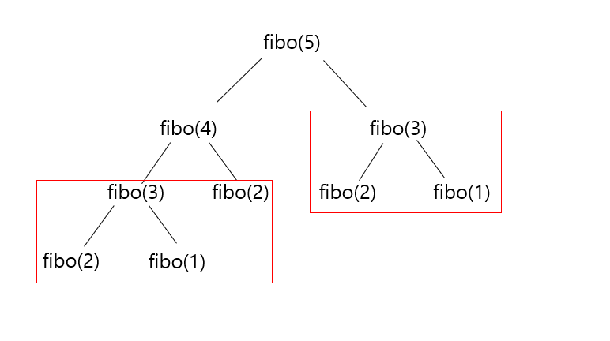

# DP
문제의 정답이 될 가능성이 있는 모든 해결책을 체계적이고 효율적으로 탐색하는 방법 <br>
problem -> sub-problem -> sub-problem -> ... <br>

---


## 원리
1. 크고 복잡한 문제를 작은 하위 문제(sub-problem)로 나눈다.
2. 하위 문제의 답을 계산한다.
   1. 하위 문제를 계산하다보면 중복 계산해야 하는 **중복 하위 문제**(overlapping sub-problem)가 생긴다.
   2. 한 번 계산한 결과는 메모리에 저장하고 중복 계산하지 않도록 만들어 속도를 향상시킨다. <br>
       = memorization, dp table
3. 하위 문제의 답을 통해 원래 문제에 대한 답을 계산한다. <br>
   = **최적 부분 구조** (optimal structure) <br>
   = 하위 문제의 최적의 해가 큰 문제의 최적의 해가 되는 구조 

<br>

## 예시
1. **피보나치 수열** :: f(n) = f(n-1) + f(n-2) <br>
   
      - 공식 : f(n) = n==1 || n==2 ? 1 : f(n-1) + f(n-2);
      - 기존 : 완전탐색으로 재귀를 하나하나 계산하여 문제 풀이
      - DP : 중복 하위 문제가 발생하므로 DP를 이용하면 중복 계산을 줄여 속도 향상
        1. fibo(2), fibo(3)은 2번 이상 연산을 수행
        2. 최초 계산 시 fibo(n)을 메모리에 저장 후 재계산을 없에 속도 향상 가능 <br>
        3. 아래와 같은 코드를 작성해 구현 가능 (Python)
        ```
        memo = {}
        
        def fibo(n):
         if n==1 or n==2:
            return 1;
        if n not in memo:
            memo[n] = fibo(n-1) + fibo(n-2)
        return memo
        ```

<br>

## 구현 방법
1. Top-down 방식
   - **재귀**를 이용하여 위에서부터 아래로 뻗어나가는 방식
   - 위에서 아래로 뻗어나가지만, 재귀를 이용하므로 결국 가장 하위 문제부터 계산됨 
   - 각 하위 문제의 결과를 메모이제이션하여, 이미 해결된 하위 문제는 다시 계산하지 않도록 함
   - 필요한 하위 문제부터 시작해 점점 더 큰 문제를 해결해 나가는 방식
     ```
      def fibonacci_top_down(n, memo=None):
          if memo is None:
              memo = {}
          if n in memo:
              return memo[n]
          if n <= 1:
              return n
          memo[n] = fibonacci_top_down(n - 1, memo) + fibonacci_top_down(n - 2, memo)
          return memo[n]
      
      # 예시 실행
      print(fibonacci_top_down(10))  # 출력: 55
     ```
2. Bottom-up 방식
   - **반복문**을 사용하여 밑에서부터 위로 뻗어나가는 방식
   - 테이블을 사용하여 각 하위 문제의 결과를 저장하고, 이를 사용하여 더 큰 문제를 해결
   - 작은 문제부터 시작하여 큰 문제를 해결하기 때문에 재귀 호출에 비해 메모리 사용이 효율적
     ```
      def fibonacci_bottom_up(n):
         if n <= 1:
            return n
         fib = [0] * (n + 1)
         fib[1] = 1
         for i in range(2, n + 1):
            fib[i] = fib[i - 1] + fib[i - 2]
         return fib[n]
   
      # 예시 실행
      print(fibonacci_bottom_up(10))  # 출력: 55
      ```
   

